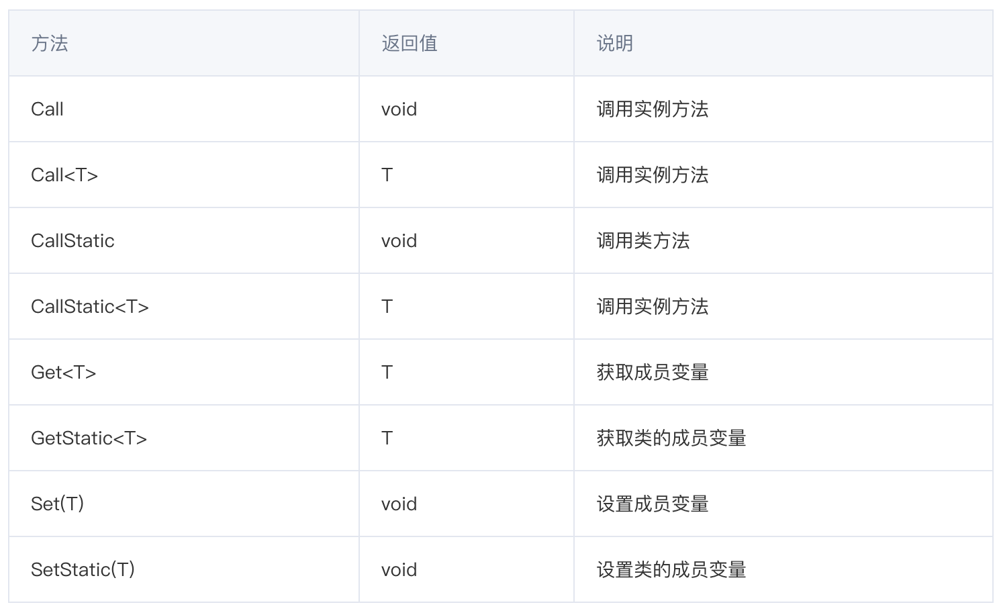
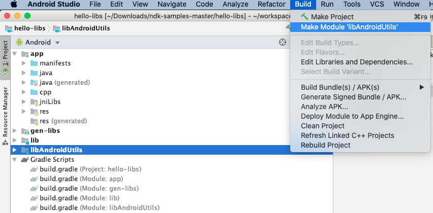
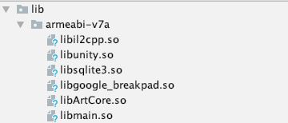

Unity和Native平台交互
----------------

## 插件的使用场景

本教程覆盖对Android iOS集成的粗略概念，关键节点和常见问题的解决方案
Unity本身是支持多个平台的，而且也提供了平台相关的接口，这些接口通常
以下场景会用到Native开发
- 集成第三方库，包括异常上报平台，广告SDK等
- 扩展功能，比如获得原生特性
- 性能提升
- 安全性

> 以下知识点基于Unity 2018.4版本


## 集成Android插件

Android 集成较为多样，也比较复杂，主要需要涉及到 gradle配置，
android库文件的一些定义（如Android Manifest文件格式和合并规则）

Unity[官网Manual](https://docs.unity3d.com/2018.4/Documentation/Manual/PluginsForAndroid.html)已经给出较为详细的介绍，这里主要做简单梳理和补充说明。  
以下是较为常用的查阅手册的链接，这些也是算是一些背景知识。

1. [AAR文件的格式说明](https://developer.android.com/studio/projects/android-library)
2. [AndroidManifest文件说明](https://developer.android.com/guide/topics/manifest/manifest-intro)
3. [AndroidManifest Merge规则](https://developer.android.com/studio/build/manifest-merge)
4. [Android gradle构建说明](https://developer.android.com/studio/build/index.html)
5. [Unity Manifest说明](https://docs.unity3d.com/2018.4/Documentation/Manual/android-manifest.html)
6. [Unity gradle说明](https://docs.unity3d.com/2018.4/Documentation/Manual/android-gradle-overview.html)


```
+-- Plugins
|   +-- Android
|       +-- libs
|           +-- arm64-v8a
|               +-- libXXX.so
|           +-- armabi-v7a
|               +-- libXXX.so
|       +-- res
|           +-- values
|           +-- xml
|               +-- provider_file_path.xml
|       +-- AndroidManifest.xml
|       +-- mainTemplate.gradle // gradle 配置
|       +-- proguard-user.txt  // 混淆配置
```

> mainTemplate.gradle 由Unity自动生成，勾选PlayerSettings - Android - Build - Custom Gradle Template
> proguard-user.txt 由Unity自动生成，勾选PlayerSettings - Android - Build - User proguard file


### 集成第三方库会遇到的问题

* 移除权限
 ```
    <uses-permission android:name="android.permission.RECORD_AUDIO" tools:node="remove" />
 ```
* 64k代码超限 [文档说明](https://developer.android.com/studio/build/multidex)

https://stackoverflow.com/questions/45848610/enabling-multidex-in-a-unity-android-project-with-crashlytics

* 插件更新后必须重启Unity可以生效


* [Unity Manual-集成中的一些常见问题](https://docs.unity3d.com/Manual/TroubleShootingAndroid.html)


### Unity API 调用

https://docs.unity3d.com/Manual/AndroidJARPlugins.html
看一下一次获取

```c#
using (AndroidJavaClass cls = new AndroidJavaClass("java.util.Locale")) { 
    using(AndroidJavaObject locale = cls.CallStatic<AndroidJavaObject>("getDefault")) { 
        Debug.Log("current lang = " + locale.Call<string>("getDisplayLanguage")); 
    } 
}
```

```
    Locale locale = java.util.Locale.getDefault();
    String lan = locale.getDisplayLanguage();
```
#### `AndroidJavaClass` 与 `AndroidJavaObject` 提供的接口如下：


#### `T` 的对象范围和对应关系
|            | Unity               | Java                    |
|:-----------|:--------------------|:------------------------|
| object对象  | `AndroidJavaObject` | `java.lang.Object`和子类 |
| class对象   | `AndroidJavaClass`  | `java.lang.Class`       |
| 基本数据类型 | int,long,string等   | int,long,string等        |


- 反射调用的性能损耗，高频调用注意cache或者单独实现统一的api(见下章节aar的集成）
- 尽量使用Using, 确保资源及时释放
- 必要时新建Mono脚本管理生命周期较长的引用
- 必要时将AndroidJNIHelper.debug设置为true，方便进行大量调用时的性能分析


### Java调用Unity
从java层调用c#层代码主要有两种方式：
1. c#层实现AndroidJavaProxy的继承，作为java对象的代理类， [参考](https://docs.unity3d.com/ScriptReference/AndroidJavaProxy.html
)

2. 直接调用静态方法 `com.unity3d.player.UnityPlayer`的静态方法 `UnitySendMessage`
* TODO size 限制

### 添加Android plugin

Unity支持 三种文件格式引入Android plugin
- aar文件
- jar文件
- 源码（java,kotlin代码文件）

推荐使用 aar或jar文件引入依赖

#### aar 和 jar的介绍

**Java ARchive (JAR)** ：Java字节码文件(.class)以及配置文件的zip压缩包，扩展后缀 `.jar`

**Android ARchive (AAR)** ：Android库资源的zip压缩包，扩展后缀是
`.aar` AAR文件必须包含 `AndroidManifest.xml` ，其余均为可选，常用目录如下：
```
classes.jar        // java classes
res/               // 资源目录
R.txt              // 资源id
public.txt         // 资源scope
assets/            // assets 原生不压缩资源
libs/name.jar      // 依赖的lib文件
jni/abi_name/name.so (where abi_name is one of the Android supported ABIs)
proguard.txt       // 混淆目录
```
#### 构建jar的例子

**准备环境**：  
Android Studio 可正常编译状态

**步骤**：
1. 新建 `Module` --> 选择类型 `Java library` -->添加代码
2. Project视图下 **选中** 新建的lib -->Build-->`Make 'your module'`



#### 针对Android library Module
如果创建的是 Android library Module, 默认build出来的是aar, 默认目录是build/outputs/aar
在Android library Module 的 `build.gradle` 中
```
task deleteJar(type: Delete) {
    delete 'outputs/yourlibname.jar'
}

task createJar(type: Copy) {
    // 注意 Android studio 版本不同情况 `/packaged-classes` 可能是 `/bundles`
    from('build/intermediates/packaged-classes/release/')
    into('outputs/')
    include('classes.jar')
    rename('classes.jar', 'yourlibname.jar')
}

createJar.dependsOn(deleteJar, build)
```

2. 从#### 集成 so 文件

so文件Linux系统的共享库，实际上Unity的C#代码也通过il2cpp编译，以so文件存放在apk安装包中的，如下图:



> apk文件可以通过Android Studio直接查看，方便分析Manifest内容和包体积占用对比

在Java层调用需要使用单独实现jni接口（Unity下的C#和C/C++一样需要通过jni实现和Java虚拟机交互）
[JNI实现参考](https://developer.android.com/training/articles/perf-jni.html)

集成的过程官网有详细介绍：[AndroidNativePlugins](https://docs.unity3d.com/2018.4/Documentation/Manual/AndroidNativePlugins.html)

 **如何构建so文件**

 构建可以选择 [ndk-build](https://developer.android.com/ndk/guides/ndk-build) 和 [Cmake](https://developer.android.com/ndk/guides/cmake) 两种方式构建

 - [一个简单的Native样例](https://github.com/Meach/UnitySimpleNativeLibrary)
 - [Android官方样例](https://github.com/android/ndk-samples/tree/master/hello-libs)

## Unity线程和jvm线程问题

1. 主线程与jvm线程

2. 线程安全访问
3. Jni调用关系


## 集成iOS插件


[UnitySendMessage效率测试](https://github.com/5argon/UnitySendMessageEfficiencyTest)

## 常用功能

1. 存储目录 https://blog.csdn.net/xingnan4414/article/details/79388972

内部存储、外部存储

2. 权限获取
3. 其他接口（震动，屏幕方向等）


参考资料
### 附录链接


[Unity Android Plugin开发指南](https://cloud.tencent.com/developer/article/1033592)

[Android反编译工具jadx-支持apk/aar/jar/dex](https://github.com/skylot/jadx)
