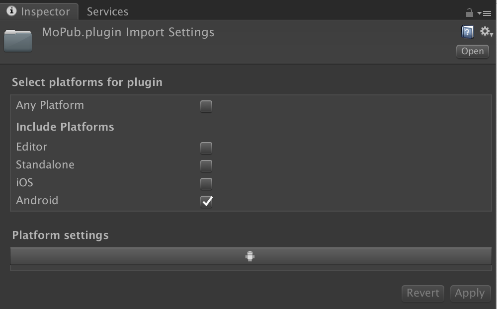

Unity和Native平台交互
----------------


## 插件的使用场景

本教程覆盖对Android 、iOS集成的粗略概念，关键节点和常见问题的解决方案。
Unity本身是支持多个平台的，而且也提供了平台相关的接口，这些接口通常以下场景会用到Native开发

- 集成第三方库，包括异常上报平台，广告SDK等
- 扩展功能，比如获得原生特性
- 性能提升
- 安全性

> 本教程知识基于Unity 2018.4版本


## 集成Android插件

Android 集成较为多样，也比较复杂，主要需要涉及到 gradle配置，
android库文件的一些定义（如Android Manifest文件格式和合并规则）

Unity[官网Manual](https://docs.unity3d.com/2018.4/Documentation/Manual/PluginsForAndroid.html)已经给出较为详细的介绍，这里主要做简单梳理和补充说明。  
以下是较为常用的查阅手册的链接，这些也是算是一些背景知识。

1. [AAR文件的格式说明](https://developer.android.com/studio/projects/android-library)
2. [AndroidManifest文件说明](https://developer.android.com/guide/topics/manifest/manifest-intro)
3. [AndroidManifest Merge规则](https://developer.android.com/studio/build/manifest-merge)
4. [Android gradle构建说明](https://developer.android.com/studio/build/index.html)
5. [Unity Manifest说明](https://docs.unity3d.com/2018.4/Documentation/Manual/android-manifest.html)
6. [Unity gradle说明](https://docs.unity3d.com/2018.4/Documentation/Manual/android-gradle-overview.html)

#### aar 和 jar的介绍
一般情况下第三方库Android实现都是以aar和jar的格式引入到Unity中的，另外可能还包括我们自己的实现，所以有必要了解一下这两种格式的说明，如果您很了解两种格式，可以跳过本小节。

**Java ARchive (JAR)**

Java字节码文件(.class)以及配置文件的zip压缩包，扩展后缀 `.jar`

**Android ARchive (AAR)** 

Android库资源的zip压缩包，扩展后缀是 `.aar`

AAR文件必须包含 `AndroidManifest.xml` ，其余均为可选，一个aar可能包括的如下：

```
classes.jar        // java classes
res/               // 资源目录
R.txt              // 资源id
public.txt         // 资源scope
assets/            // assets 原生不压缩资源
libs/name.jar      // 依赖的lib文件
jni/abi_name/name.so (where abi_name is one of the Android supported ABIs)
proguard.txt       // 混淆目录
```
Tips
> 通过 Android Studio 可以直接查看 aar和apk文件，将该类文件直接拖入即可
通过上面的简单介绍，我们可以了解到aar文件实际上是资源包类型，可以包括代码和资源配置。

开始介绍具体的集成之前，我们先看一下集成Android插件后的Unity工程是什么样子的:

```
+-- Plugins
|   +-- Android
|       +-- YourModuleFolderName
|           +-- your_module1.jar // jar库文件
|           +-- your_module2.aar // aar库文件
|       +-- libs
|           +-- arm64-v8a
|               +-- libXXX.so   // so文件
|           +-- armabi-v7a
|               +-- libXXX.so
|       +-- res
|           +-- values
|           +-- xml
|               +-- provider_file_path.xml
|       +-- AndroidManifest.xml   // AndroidManifes配置清单
|       +-- mainTemplate.gradle 	// gradle 配置
|       +-- proguard-user.txt  	// 混淆配置
```

备注：

> mainTemplate.gradle 由Unity自动生成，需勾选 `PlayerSettings Android` -
  `Build` - `Custom Gradle Template`

> proguard-user.txt 由Unity自动生成，需勾选 `PlayerSettings` - `Android` -
  `Build` - `User proguard file`

下面的章节我们会介绍关于 jar, aar的集成和打包，还有so文件的构建

### 集成的一般步骤
我们先来看一下Android plugin集成的过程是怎样的：

1. 第一步 ：制作plugin ，可能是 jar或者aar（如果第三方库的话直接下一步）
2. 第二步 ：添加puglin
	- 将制作的jar或者aar直接放入Unity工程中
	- 第三方的库一般都添加了C#端接口，根据官方文档集成即可
3.  第三步 ：调用Api
	- 必要的话实现一遍实现C#桥接接口
下面我们先从第二步开始讲解，第一步内容放在章节的后半部分。

### 添加Android plugin
前面提到了 aar 和 jar，其实Unity支持**三种**文件格式引入Android plugin：

- aar文件
- jar文件
- 源码（java,kotlin代码文件）

以上四种格式后缀的文件导入到Unity工程后会自动标记为plugin，打开 `Inspctor` 视图可见：



这三种方式如何选择呢？ 前面我们介绍了aar格式，如果要包含资源文件必须使用aar，如果仅仅是代码文件的话三种方式均可以使用。

- 包含资源文件必须使用aar。
- 简单而且功能单一的实现尝试源码，较为方便
- 功能复杂，多个文件的建议达成jar包，方便版本管理


### Plugin API 调用
导入java库文件之后，我们就可以在Unity中进行调用了。Android sdk中的任何实现均可以直接调用，
所以建议自己实现接口需要先用java语言在Android Studio中编写，方便确定依赖的库文件。

下面一个例子，介绍了如何获得Android设备本地默认语言，我们用两种方式进行演示：

**实现1 ： 调用Android SDK中已经实现的接口**


Android Studio Java实现：

```
    Locale locale = java.util.Locale.getDefault();
    String lan = locale.getDisplayLanguage();
```

Unity C#实现：

```c#
using (AndroidJavaClass cls = new AndroidJavaClass("java.util.Locale")) { 
    using(AndroidJavaObject locale = cls.CallStatic<AndroidJavaObject>("getDefault")) { 
        var lan = locale.Call<string>("getDisplayLanguage"); 
    } 
}
```

**实现2 实现java util，通过util接口调用**

编写`LanguageUtil.java`，以编译后的jar文件或者源码导入到Unity工程。
代码如下：

```java
package com.example.unityplugin;

import java.util.Locale;

public class LanUtil {

    public static String GetDefaultDisplay() {
        Locale locale = Locale.getDefault();
        return locale.getDisplayLanguage();
    }
}

```

Unity C#实现：

```c#
using (AndroidJavaClass cls = new AndroidJavaClass("com.example.unityplugin.LanUtil")) { 
  var lan = cls.CallStatic<string>("GetDefaultDisplay")); 
}
```
上面例子中 `AndroidJavaClass` `AndroidJavaObject` 是java层对应实现，请看下面两个表格中的详细介绍。

 `AndroidJavaClass` 与 `AndroidJavaObject` 提供的接口如下：


 `T` 的对象范围和对应关系
 
|            | Unity               | Java                    |
|:-----------|:--------------------|:------------------------|
| object对象  | `AndroidJavaObject` | `java.lang.Object`和子类 |
| class对象   | `AndroidJavaClass`  | `java.lang.Class`       |
| 基本数据类型 | int,long,string等   | int,long,string等        |

####Tips:

- 反射调用的性能损耗，高频调用注意cache或者单独实现统一的api(见下章节aar的集成）
- 尽量使用Using, 确保资源及时释放
- 必要时新建Mono脚本管理生命周期较长的引用
- 必要时将AndroidJNIHelper.debug设置为true，方便进行大量调用时的性能分析


### Java调用Unity
从java层调用c#层代码主要有两种方式：

1. c#层实现AndroidJavaProxy的继承，作为java对象的代理类， [参考](https://docs.unity3d.com/ScriptReference/AndroidJavaProxy.html
)

2. 直接调用静态方法 `com.unity3d.player.UnityPlayer`的静态方法 `UnitySendMessage`
> 这需在Android工程中添加Unity提供的jar依赖，它位于Unity安装目录下：
> Unity/PlaybackEngines/AndroidPlayer/Viariations/{backend}/{buildType}/Classes/classes.jar

 - **backend**: mono、il2cpp
  - **buildType**:  debug 、 release
 
 Tips: **建议UnitySendMessage 返回的string不超过1k大小, 有遇到数据丢失情况** 

### 如何制作Android plugin

#### 构建jar的例子

**准备环境**：  
Android Studio 可正常编译状态

**步骤**：

1. 新建 `Module` --> 选择类型 `Java library` -->添加代码
2. Project视图下 **选中** 新建的lib -->Build-->`Make 'your module'`


#### 针对Android library Module
如果创建的是 Android library Module, 默认build出来的是aar, 默认目录是 `build/outputs/aar`。
那如果我们想导出jar文件也是可以的，实际上 `build/intermediates`文件目录中存放着有编译过程的中间文件，其中就有我们需要的jar文件，我们只需要copy出来即可。为了方便起见，我们可以添加一个 gradle task来完成这件工作。

在Android library Module 的 `build.gradle` 的最后添加以下代码：

```
task deleteJar(type: Delete) {
    delete 'outputs/yourlibname.jar'
}

task createJar(type: Copy) {
    // 注意 Android studio 版本不同情况 `/packaged-classes` 可能是 `/bundles`
    from('build/intermediates/packaged-classes/release/')
    into('outputs/')
    include('classes.jar')
    rename('classes.jar', 'yourlibname.jar')
}

createJar.dependsOn(deleteJar, build)
```

#### 集成 so 文件

so文件Linux系统的共享库，实际上Unity的C#代码也通过il2cpp编译，以so文件存放在apk安装包中的，如下图:


> apk文件可以通过Android Studio直接查看，方便分析Manifest内容和包体积占用对比

集成的过程同官网有详细介绍：[AndroidNativePlugins](https://docs.unity3d.com/2018.4/Documentation/Manual/AndroidNativePlugins.html)

 **如何构建so文件**

 构建可以选择 [ndk-build](https://developer.android.com/ndk/guides/ndk-build) 和 [Cmake](https://developer.android.com/ndk/guides/cmake) 两种方式构建

 - [一个简单的Native样例](https://github.com/Meach/UnitySimpleNativeLibrary)
 - [Android官方样例](https://github.com/android/ndk-samples/tree/master/hello-libs)

### 集成中必须了解的5种情况

* 集成第三库时，想要覆盖或者删除manifest文件的特定表情，可以使用`Merge rule markers`，详情可以查询  [AndroidManifest Merge规则](https://developer.android.com/studio/build/manifest-merge) ，下面举两个常见例子：

	1.移除第三库中声明的录制音频权限 `android.permission.RECORD_AUDIO` ：
 ```
    <uses-permission android:name="android.permission.RECORD_AUDIO" tools:node="remove" />
 ```
 
 	2 覆盖第三方库中的应用属性`android:allowBackup` ：
 ```
   <application android:allowBackup="false" android:label="@string/app_name"  tools:replace="android:allowBackup">
```

* 分享文件
	- 背景：Android 从 N 开始不允许以 `file://` 的方式通过 Intent 在两个 App 之间分享文件，取而代之的是通过 FileProvider 生成 `content://Uri` 
	- 如何集成 : [Android官方说明-FileProvider](https://developer.android.com/reference/kotlin/androidx/core/content/FileProvider) 或者[中文教程](https://zhuanlan.zhihu.com/p/26139355) 
	- 有个异常：如果涉及到SDcard的问题 出现 `java.lang.IllegalArgumentException: Failed to find configured root that contains` [参考解决](https://blog.csdn.net/ygz111111/article/details/94744124)


* 修改Android启动Activity `AndroidUnityPlayerActivity`, [官方Manul](https://docs.unity3d.com/2018.4/Documentation/Manual/AndroidUnityPlayerActivity.html
)

* 修改Android启动Application ，过程与修改`AndroidUnityPlayerActivity`类似，[比如同时支持 `multidex ` 和 `crashlytics`]( https://stackoverflow.com/questions/45848610/enabling-multidex-in-a-unity-android-project-with-crashlytics)
 
* 如果你集成较多的第三方库的时候会遇到64k代码超限的情况
	[文档说明](https://developer.android.com/studio/build/multidex)

* 还有[Unity Manual-集成中的一些常见问题](https://docs.unity3d.com/Manual/TroubleShootingAndroid.html)


## 集成iOS插件
iOS集成较为简单，一个常见的plugin目录如下

```
+-- Plugins
|   +-- iOS
|       +-- YourModuleFolderName          //源码引入
|           +-- xx.h
|           +-- xx.mm
|       +-- YourLibName.framework   // framework库
```

现在，我们们引入`YourLibName` 的Android,iOS native库，native
方法`FooPluginFunction`最终的声明如下

```
       #if UNITY_IPHONE
   
       // On iOS plugins are statically linked into
       // the executable, so we have to use __Internal as the
       // library name.
       [DllImport ("__Internal")]

       #else

       // Other platforms load plugins dynamically, so pass the name
       // of the plugin's dynamic library.
       [DllImport ("YourLibName")]
    
       #endif

       private static extern float FooPluginFunction ();

```


集成的过程和调用官网介非常详细：

[官方手册](https://docs.unity3d.com/Manual/PluginsForIOS.html)

参考：

[iOS生成Framework库](https://blog.csdn.net/shifang07/article/details/102549906)


## 扩展知识
这部分主要介绍一些不常用，但需要了解的知识点，主要分两个部分:

1. Android平台下的线程问题
2. 目录存储

### Unity线程和Android线程问题

#### 问题
开始下面章节之前，先回答一个问题：  
Unity子线程可以创建 `AndroidJavaClass`吗？

#### 背景介绍

我们都知道，Android系统是基于Linux系统的，Android系统上的线程也是Linux线程。  
对于Unity来说，如果创建一个Unity下的线程，这个线程就是标准的Linux线程，这个标准线程和Android线程是有区别的。
一个Android进程对应一个虚拟机实例，所以所有Android层创建的线程都是运行在Android虚拟机下（对Java虚拟机实现的优化改进版）
而对于使用C/C++代码运行的线程(`pthread_create()` 和
`std:thread`)，只是一个标准的Linux线程，必须**绑定虚拟机环境**才能访问java的托管代码。

#### 正确的访问流程
正确的的过程是：

1. 创建线程
2. 调用 `AttachCurrentThread` 绑定`JNIEnv`
3. 做一些java代码访问
4. `DetachCurrentThread`

示例：

```
      bool isAttached = bsg_unity_isJNIAttached();
      if (!isAttached) {
        AndroidJNI.AttachCurrentThread();
      }
      using (AndroidJavaObject map = BuildJavaMapDisposable(metadata))
      {
        CallNativeVoidMethod("leaveBreadcrumb", "(Ljava/lang/String;Ljava/lang/String;Ljava/util/Map;)V",
            new object[]{name, type, map});
      }
      if (!isAttached) {
        AndroidJNI.DetachCurrentThread();
      }
```
>  以上代码
>  [参考](https://github.com/bugsnag/bugsnag-unity/blob/master/src/BugsnagUnity/Native/Android/NativeInterface.cs)
>  [Jni线程判断的实现](https://github.com/bugsnag/bugsnag-unity/blob/master/bugsnag-android-unity/src/main/jni/bugsnag_unity.c)

**Unity主线程**   
Mono脚本运行线程，可以认为Android的一个子线程，可以访问java托管代码，但不能更新Android的UI。

**Android主线程**  
可以进行主要UI工作的线程(Android-5.0后, 有RenderThread处理UI渲染工作）

参考：

- [oracle官方手册](https://docs.oracle.com/javase/1.5.0/docs/guide/jni/spec/jniTOC.html)
- [Android架构](https://developer.android.com/guide/platform)
- [Android Jni 线程说明](https://developer.android.com/training/articles/perf-jni#threads)
- [JNI实现参考](https://developer.android.com/training/articles/perf-jni.html)

### 存储目录
Unity中提供了获取平台默认存储目录的方法 --`Application.persistentDataPath`， 这个方法不同平台下的路径是不同的，具体的：

- iOS平台下 路径为 `/var/mobile/Containers/Data/Application/<guid>/Documents`
- Android平台下路径为 `/storage/emulated/0/Android/data/<packagename>/files`

Android的目录是放在**外部存储**，
**如果是私密或者重要的数据建议放在[内部存储](https://developer.android.com/training/data-storage/files/internal?hl=zh-cn#WriteFileInternal)**


### 了解更多

- [Unity Android Plugin开发指南](https://cloud.tencent.com/developer/article/1033592)
- [Android反编译工具jadx-支持apk/aar/jar/dex](https://github.com/skylot/jadx)
- [Android只在UI主线程修改UI?](https://www.zhihu.com/question/24764972)
- [Android存储目录](https://blog.csdn.net/xingnan4414/article/details/79388972)
- [iOS UnitySendMessage效率测试](https://github.com/5argon/UnitySendMessageEfficiencyTest)
